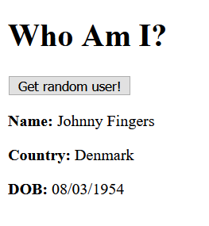

## Who Am I  
There is a handy dandy website [randomuser.me](https://randomuser.me) that has an [api](https://randomuser.me/api/) that you can use to fetch random user data.

Using that api, fetch some user data and render it on the page like this...

